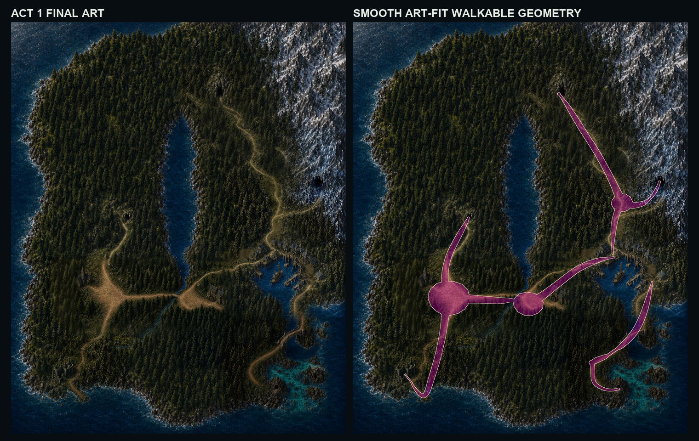

# Act 1 final art and geometry

Status: **FINAL DESIGN GO — NOT RUNTIME-PROMOTED**

R26 closes the Act 1 design loop with one atomic art/geometry pair:

- The road, hub, junction, bridge, and entrance polygons use smooth,
  deliberately simplified curves fitted to the visible painting.
- Coastal Reef now has one continuous painted and walkable trail from the
  southeast Port branch to the visible cave-foot endpoint `(1877,2596)`.
- Port Sapphire still has three disconnected overworld approaches.
- Sunken keeps the exact straight `[(411,2548),(370,2495)]` throat at width 11.
- The seven semantic routes, quest guards, Crystal seal, and forbidden
  shortcuts remain intact.

The Coastal art correction is bounded to 48,305 changed pixels inside exclusive
world bounds `(1610,2335)–(1944,2670)`. The rest of the approved G6 candidate is
unchanged.

Locked design hashes:

- Art: `d5998e758b8e1090a0f2bb18cde0197b4cf756161b2c8db84ebe2a6d7aca23cd`
- Vector authority: `4010715a99926260a9d4e842cc97e0e6e04df93bffbc69b4ccf4ef4baf086834`
- Derived mask: `c914aab7f76ad22894a9d233068d895f567773e284d7eb5d659d139b371d9577`
- Native overlay: `88ee10ed67a4129c7ed3513718effa9eed2e52aa26fdd61a2e02c55e359dea79`

No runtime, manifest, collision adapter, route source, save, `public/`, `dist/`,
build, branch, commit, push, deployment, or release surface was changed.

